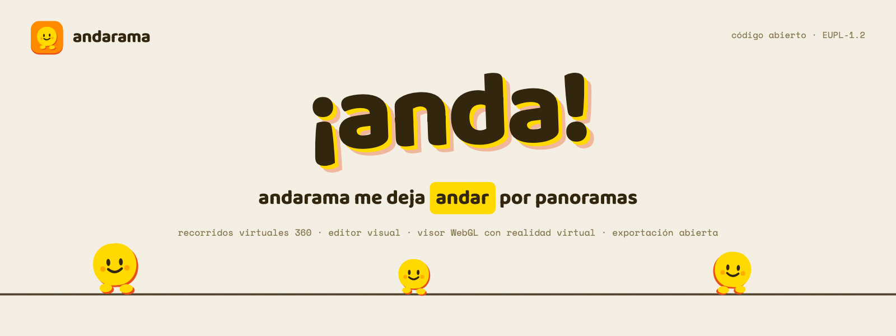
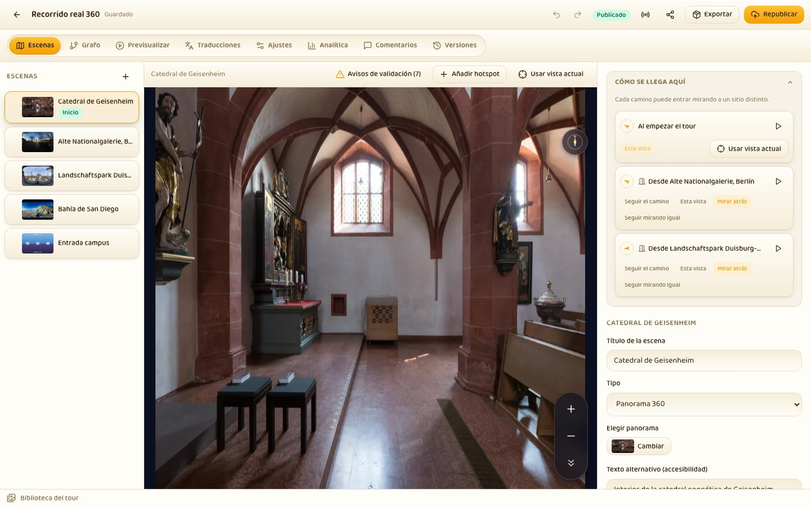
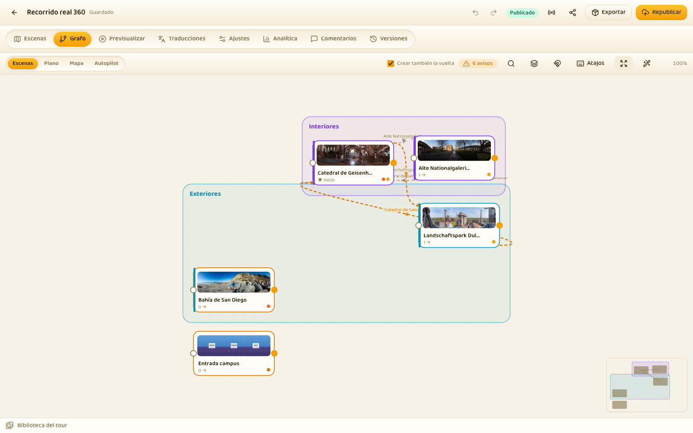
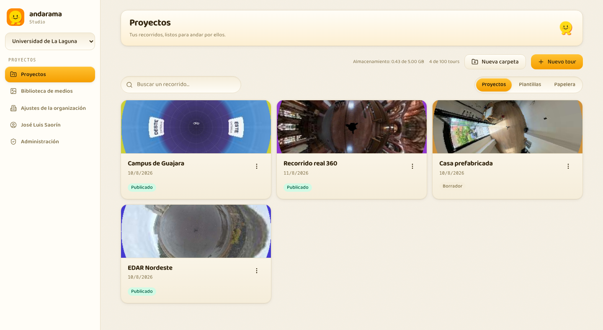
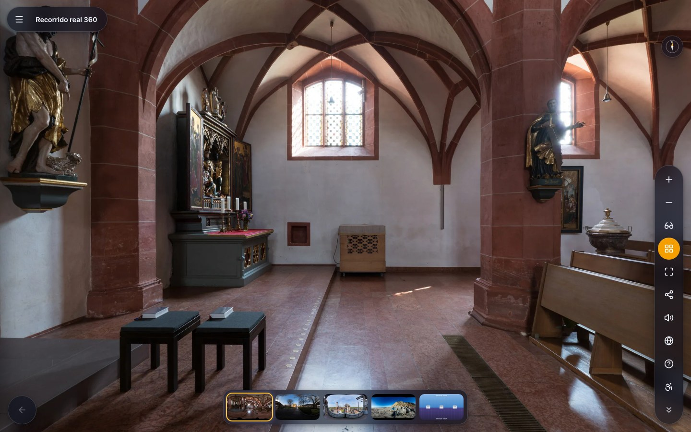
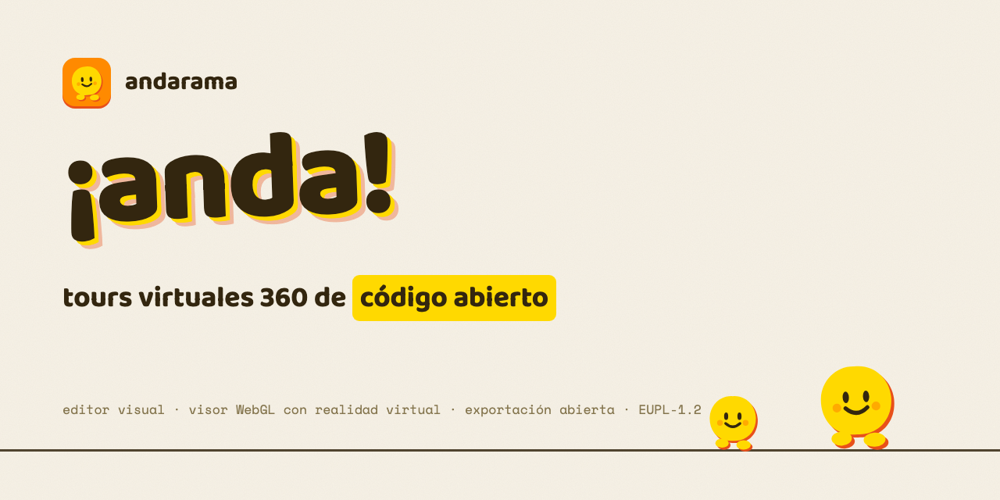

<p align="center">
  
</p>

<p align="center">
  <a href="LICENSE"></a>
  <a href="https://github.com/joseluissaorin/andarama/actions/workflows/ci.yml"></a>
  
  
  <a href="https://andarama.com"></a>
</p>

<p align="center">
  <a href="https://andarama.com"><b>Web</b></a> ·
  <a href="https://app.andarama.com"><b>Studio</b></a> ·
  <a href="https://docs.andarama.com"><b>Documentación</b></a> ·
  <a href="https://andarama.com/t/recorrido-real"><b>Tour de ejemplo</b></a> ·
  <a href="README.en.md"><b>English</b></a>
</p>

---

Andarama es una plataforma de código abierto para **crear, publicar y compartir recorridos virtuales 360**. Se suben fotos esféricas, se conectan como quien dibuja un plano y sale un recorrido que se pasea desde cualquier navegador, también con gafas de realidad virtual. Sin plugins, sin cuenta de pago y sin dejar los datos en casa ajena: corre entero en la capa gratuita de Cloudflare o en un contenedor Docker propio.

Nació como **ULL360**, un encargo de la Universidad de La Laguna, y hoy es un proyecto independiente que puede usar cualquier organización.

## Qué trae dentro

<table>
  <tr>
    <td width="22%"><b>Editor visual</b></td>
    <td>Escenas, hotspots y grafo del recorrido con vista previa WYSIWYG del visor real. Arrastrar una escena sobre el panorama crea el paso hacia ella.</td>
  </tr>
  <tr>
    <td width="22%"><b>Diecisiete tipos de hotspot</b></td>
    <td>Navegación, texto, imagen, galería, vídeo, audio, PDF, web incrustada, modelo 3D, cuestionario, formulario, polígono, estado, tesoro y más, todos accionables también dentro de las gafas.</td>
  </tr>
  <tr>
    <td width="22%"><b>Visor WebGL</b></td>
    <td>Multirresolución con teselado propio, vídeo 360, audio espacial, proyecciones (little planet, estenopeica, ojo de pez), brújula, plano y giroscopio.</td>
  </tr>
  <tr>
    <td width="22%"><b>Realidad virtual de verdad</b></td>
    <td>WebXR con manos de 25 articulaciones y mandos, más modo cartón para móviles sin WebXR. Se abre la URL en las gafas y ya.</td>
  </tr>
  <tr>
    <td width="22%"><b>Publicación en un clic</b></td>
    <td>Enlace público, incrustable con un <code>&lt;script&gt;</code>, dominio propio por CNAME, contraseña, caducidad, apertura en recorrido o en modo quiosco, y tarjeta social con la proyección real de la escena.</td>
  </tr>
  <tr>
    <td width="22%"><b>Exportación abierta</b></td>
    <td>Paquete ZIP estático autocontenido, fichero HTML único, SCORM 1.2 y 2004, modo quiosco y PWA. Lo exportado funciona sin Andarama detrás.</td>
  </tr>
  <tr>
    <td width="22%"><b>Colaboración</b></td>
    <td>Presencia y bloqueo por escena con Durable Objects, comentarios, versiones y visitas guiadas en directo.</td>
  </tr>
  <tr>
    <td width="22%"><b>Accesibilidad y idiomas</b></td>
    <td>Recorrido en texto plano alternativo, foco visible, objetivos de 44 px, <code>prefers-reduced-motion</code> respetado y traducciones por escena y por hotspot.</td>
  </tr>
</table>

## El editor

<p align="center">
  
</p>

La orientación con la que se entra en una sala **no es de la sala, es del camino**: entrar en el salón desde el pasillo y entrar desde la cocina son dos llegadas distintas y cada una guarda su vista. El panel «Cómo se llega aquí» las reúne todas para poder decidirlas estando en la escena de destino, que es el único sitio donde se puede juzgar el resultado.

<table>
  <tr>
    <td width="50%"></td>
    <td width="50%"></td>
  </tr>
  <tr>
    <td><b>El grafo</b>: cada flecha <i>es</i> un hotspot de navegación, no un dato paralelo. Se conecta arrastrando desde el borde del nodo y la vuelta se crea de una vez.</td>
    <td><b>El tablero</b>: carpetas, plantillas, papelera y buscador. La portada de cada tour es el panorama de su escena inicial.</td>
  </tr>
</table>

## El visor

<p align="center">
  
</p>

Cristal oscuro sobre cualquier panorama, dock de controles agrupado, tira de miniaturas y nada que tape la foto. Se puede probar en vivo: [andarama.com/t/recorrido-real](https://andarama.com/t/recorrido-real) (fotografías de Wikimedia Commons bajo CC BY-SA, con las atribuciones dentro del propio tour).

## Poner uno en marcha

### Cloudflare, un comando

Todo Andarama cabe en Workers, D1, R2, KV, Durable Objects, Queues y Analytics Engine, dentro de la capa gratuita para usos pequeños y medios.

```bash
git clone https://github.com/joseluissaorin/andarama && cd andarama
pnpm install
pnpm deploy:cloudflare
```

El guion crea los recursos que falten, aplica las migraciones y deja la instancia servida en tu dominio.

### Docker, un fichero

Una sola imagen con Node y SQLite que replica el comportamiento de Cloudflare mediante la capa de adaptadores.

```bash
curl -O https://raw.githubusercontent.com/joseluissaorin/andarama/main/deploy/docker/docker-compose.yml
docker compose up -d
```

Guía completa de ambos caminos en [docs.andarama.com](https://docs.andarama.com).

## Desarrollo

Requisitos: Node.js 20 o superior y pnpm 10.

```bash
pnpm install
pnpm build:packages      # compila packages/
pnpm dev                 # API en local (wrangler dev, puerto 8787)
pnpm dev:studio          # Studio con Vite (puerto 5173, proxy a la API)
pnpm dev:node            # variante self-host (Node + SQLite) en el 8788
pnpm test                # 242 pruebas unitarias (Vitest)
pnpm test:e2e            # 20 pruebas E2E (Playwright, servidor real)
pnpm lint && pnpm typecheck
```

Para tener contenido con el que jugar, `scripts/seed-demo.mjs` construye y publica el tour de demostración contra cualquier instancia:

```bash
node scripts/seed-demo.mjs <url-base> <email> <password> <dir-panoramas>
```

## Cómo está montado

```
andarama/
├─ apps/
│  ├─ studio/            # Editor SPA (React + Vite + TanStack + Zustand)
│  ├─ api/               # Worker Hono: API, auth, servido de tours y assets
│  ├─ realtime/          # Durable Objects (LiveTourRoom, ProjectPresence)
│  ├─ landing/           # La portada de andarama.com
│  └─ docs/              # Documentación (Astro Starlight)
├─ packages/
│  ├─ schema/            # tour.json: tipos, JSON Schema y migradores de versión
│  ├─ viewer/            # Motor 360 (WebGL sobre Marzipano, con capas propias)
│  ├─ viewer-ui/         # Skin del visor (Web Components, sin framework)
│  ├─ tiler/             # Teselado en el navegador (WebWorkers) y en Node (sharp)
│  ├─ exporter/          # Paquetes estáticos, SCORM, quiosco y PWA
│  ├─ adapters/          # Interfaces + implementaciones cloudflare/ y node/
│  ├─ db/                # Esquema Drizzle + migraciones (D1 y SQLite)
│  └─ ui/                # Design system del Studio (Radix + Tailwind)
├─ deploy/               # wrangler.jsonc, bootstrap, Dockerfile, compose
└─ tooling/              # eslint, tsconfig, Playwright, imágenes de marca
```

Tres reglas de oro sostienen el conjunto:

1. **Ningún módulo de dominio habla con Cloudflare.** Todo pasa por `packages/adapters`, que es lo que permite que el self-host no sea un puerto sino la misma aplicación.
2. **`tour.json` es el contrato.** Cambiarlo exige versión nueva y migrador en `packages/schema`; lo exportado tiene que seguir abriéndose dentro de diez años.
3. **El visor no depende de ningún framework.** Se incrusta en cualquier página con una etiqueta y sobrevive a la moda de turno.

La trazabilidad de la especificación a la implementación está en [REQUIREMENTS.md](REQUIREMENTS.md).

## Contribuir

Las contribuciones son bienvenidas, desde una errata hasta un idioma nuevo o un tipo de hotspot. Empieza por [CONTRIBUTING.md](CONTRIBUTING.md); si vienes a mirar, los issues con la etiqueta `good first issue` son un buen sitio por donde entrar. Este proyecto se rige por su [código de conducta](CODE_OF_CONDUCT.md).

Para vulnerabilidades, nada de issues públicos: [SECURITY.md](SECURITY.md) explica el canal privado.

## Licencia

[EUPL-1.2](LICENSE), una licencia copyleft de la Comisión Europea compatible con GPL, AGPL, MPL y EPL. En corto: se puede usar, estudiar, modificar y redistribuir, incluso comercialmente, siempre que el trabajo derivado se comparta con la misma licencia o una compatible.

Los materiales de terceros (tipografías, dependencias) y el origen del proyecto están en [NOTICE.md](NOTICE.md). Autoría en [AUTHORS](AUTHORS). Las fotografías del tour de demostración proceden de Wikimedia Commons bajo CC BY-SA, con sus atribuciones dentro del tour.

<p align="center">
  
</p>

<p align="center">
  <sub>Hecho por <a href="https://joseluissaorin.com">José Luis Saorín</a> · <a href="https://andarama.com">andarama.com</a></sub>
</p>
